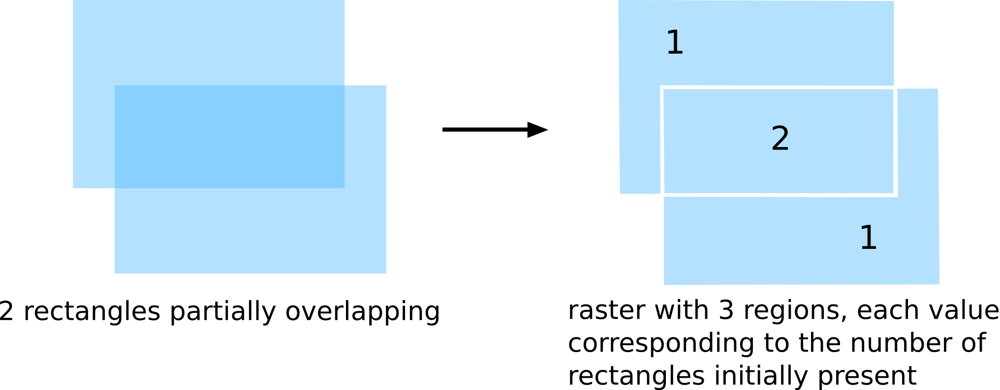
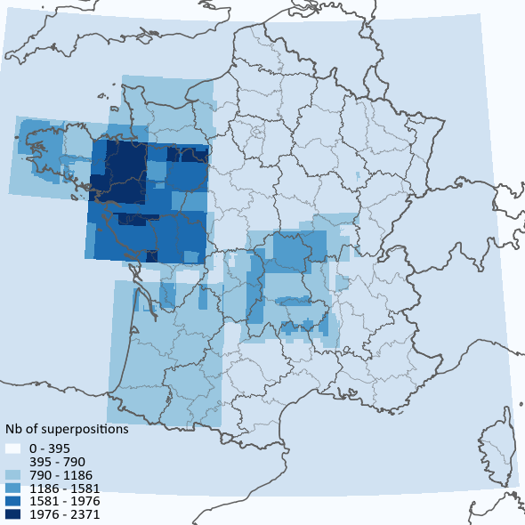

# metadata-extents

##Synopsis

This is a python script that creates an ASC raster layer counting superpositions of rectangular extents defined by four coordinates.

The resulting ASC layer can be viewed in GIS software to produce this kind of maps :

##Motivation

This script is used to analyze Spatial Data Infrastructures for the GEOBS research project : https://www-iuem.univ-brest.fr/pops/projects/geobs.

##Dependencies

- numpy : package for scientific computing with Python, http://www.numpy.org/
- pandas : Python data analysis library, http://pandas.pydata.org/

##How to run

This script uses a CSV file as an input, with each line corresponding to one rectangular extent, and 4 columns for the 4 coordinates of each extent (west, east, north, south). These 4 columns can be in any order and labeled as you wish.
Open metadata_extents.py with a text editor and set the variables at the beginning of the script : 
- resolution (same unit as coordinates used in CSV, i.e degrees if coordinates in WGS84)
- path to CSV
- delimiter of CSV
- quotechar of CSV
- names of CSV columns
- name of output raster which will be created
- name of log file

Once you've set these variables, run the script (http://pythoncentral.io/execute-python-script-file-shell/).

##License

This project is published under the General Public License v3.

